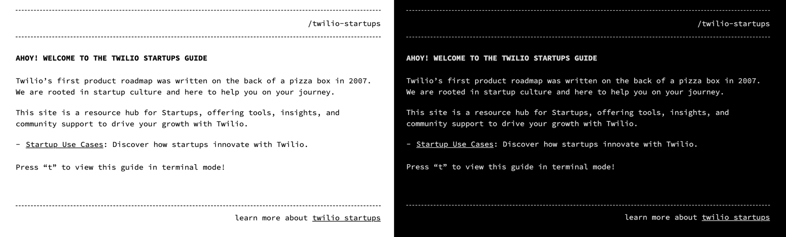

# Welcome to the Twilio Startups Guide!

This repository is a comprehensive resource hub designed specifically for startups. Twilio's journey began in 2007 with a product roadmap sketched on the back of a pizza box. Rooted in startup culture, we are here to empower you on your entrepreneurial path.

[<kbd>  Visit Twilio Startups Guide  </kbd>](https://twilio.github.io/startups)

Explore our curated resources to discover a wide range of tools, insights, and community support that can help your startup grow effectively using Twilio's suite of services.

